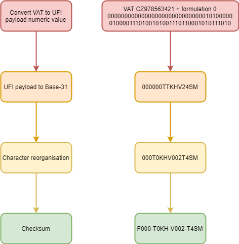

# UFI Generator - Unique Formula Identifier

UFI Generator created in C#
Creates UFI code based on VAT No. and formulation number.
Check it out here: https://generator-ufi.com
Ufi decoder: https://decoder-ufi.com

Based on ECHA [UFI Developers Manual](https://poisoncentres.echa.europa.eu/documents/22284544/22295820/ufi_developers_manual_en.pdf/9d47a5c9-ba58-4b5c-8101-7d5610928035)

https://poisoncentres.echa.europa.eu/en/ufi-generator

Used in SBLCore - safety data sheet and UFI management software [SBLCore](https://www.sblcore.com)
